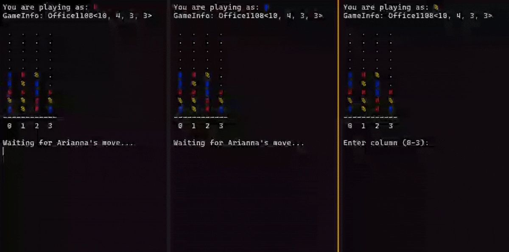
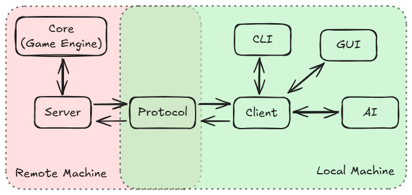

# ConnectX Game Suite

Connect X game with client-server architecture enabling local/online multiplayer and AI opponents.
Modular design with decoupled game engine, network protocol, and CLI/GUI interfaces.




## Story

The project was born during Christmas holidays back in 2017, as a simple implementation of the classic Connect 4 game.
This was actually my tentative to practice a bit of `C` programming language, which I had just started to learn at high school with some basic concepts.
At the time of the [first implementation](https://github.com/Bocchio01/connectx-game-suite/blob/b49d9c361ce1d9fe050c7089223ad08af99b6da1/Main.c), I had no idea about arrays and the program turned out to be an ugly mess of 1400 lines.
Luckily, soon after that, I learned about arrays and the code was refactored to be much more readable and maintainable.

Leaving the project aside for a while, in 2023 I had the need to practice about managing larger `C/C++` projects and decided to improve once again this repo by cleaning up the code, modularizing it and playing around with proper build systems.

Despite being already functional, I always had the dream of adding networking capabilities to the game, removing the need of having both players on the same machine.
So here we are in 2025, with a complete rework of the project, now called **ConnectX Game Suite**, which includes a proper client-server architecture, enabling local/online multiplayer and ~~AI opponents~~ (not yet, be patient..).


## Overview

ConnectX Game Suite is a (semi-)professional implementation of the classic Connect 4 game built with modern `C++` and with a focus on clean architecture.
The project demonstrates how to build a networked multiplayer game with properly separated concerns, making each component testable and reusable independently.
The implementation uses a client-server model where a central server manages game sessions while multiple clients can connect to play.



The modular design allows for multiple deployment scenarios.
Players can compete locally on the same machine, play online across different networks, or challenge AI opponents.
The system supports custom board sizes, variable player counts, and different win conditions.
Games can be created with names for easy discovery, and automatic matchmaking connects players to available sessions.

Each module serves a specific purpose.
- **Core**: handles all game logic, including board state, move validation, and win detection;
- **Protocol**: defines the message formats and communication rules between clients and server;
- **Server**: manages multiple game sessions, enforces rules, and coordinates player interactions;
- **Client library**: provides a high-level API for clients to interact with the server, abstracting away networking details;
- **CLI**: offers a terminal-based interface for players to join games and make moves.
- **GUI**: (coming soon) will provide a graphical interface for a more user-friendly experience.
- **AI module**: (coming soon) will allow players to compete against computer-controlled opponents.


## Quick start guide

Here's a quick guide to get you started with `ConnectX Game Suite`.

### Building from source

The project uses `CMake` as build system.
To build the project, simply run the following commands in the project root directory:

```bash
git clone https://github.com/Bocchio01/connectx-game-suite.git
cd connectx-game-suite
mkdir build && cd build
cmake ..
cmake --build .
```

This will generate the executables for the client and server in the `build/bin` directory.

### Running the first game

To start a server, run the following command in a terminal:

```bash
./connectx-server
```

This will start the server on the default port `8080`.
In another terminal, start a client to connect to the server:

```bash
./connectx-cli
```

This will launch the CLI interface, that will automatically connect to the server running on `localhost:8080` and join an open game or create a new standard game if none is available.
Wait for another player to join the game (you can open another terminal and start another client to simulate a second player) and just have fun!

### Hosting the server

Running on a local machine is fine for testing, but if you want to play online with friends, you'll need to host the server on a public machine.
You can use any VPS provider or cloud service that allows you to run custom applications.
Make sure to open the server port in the firewall settings to allow incoming connections.
Once the port is open, start the server on the public machine in daemon mode:

```bash
./connectx-server --daemon --port X
```

Then, when starting the client, specify the server address:

```bash
./connectx-cli --host X.X.X.X --port X
```

Replace `X.X.X.X` with the public IP address of the server and `X` with the port number you configured.

> [!TIP]
> @DLR, you can find an instance of the server running on the node `rmc-lx0274:8080`.
> Connect to it using `./connectx-cli --host rmc-lx0274`, or directly modify the constructor of the `CLIInterface` class by replacing the current default `localhost`.


## Known issues

The game is overall stable, but there are still some known issues/bugs:
- **User input handling in CLI**: if the user inputs valid data while waiting for its turn, the input is stored in the input buffer and processed when the turn actually arrives, which leads to unvoluntary moves. A possible solution is to flush the input buffer when the turn starts or going dual-threaded and have a dedicated thread for user input (overkill);
- **Server disconnection handling**: again, if a client is waiting for user input and the server shut downs, the client will not be able to process the disconnection event until the user inputs something. I guess here the only solution is to go dual-threaded..;


## Future improvements

Scalability is a concern, as the server makes intense use of synchronous/blocking calls via `mutexes` to ensure thread safety.
This is fine for probably handling some dozens of games and few hundreds of concurrent players, but for larger scale deployments, an asynchronous/event-driven architecture would be more appropriate.
Load testing and profiling will be performed in the future to identify bottlenecks and optimize performance.

As said before, an AI module is planned to allow players to compete against computer-controlled opponents.
I'm planning to implement all the classic AI algorithms (Minimax, Alpha-Beta pruning, Monte Carlo Tree Search, etc.) and allow users to select the type of AI they want to face.
Moreover, given that I have in mind some project requiring ML on embedded systems, I would also like to experiment with `TensorFlow` and `TensorFlow Lite` to build a simple neural network capable of playing ConnectX at a decent level.

Of cource, a GUI interface is also planned.


## Contributing

Contributions are welcome! If you find a bug or have a feature request, please open an issue on GitHub.
If you want to contribute code, please fork the repository and create a pull request with your changes.

Have a nice coding day,

Tommaso :panda_face:
